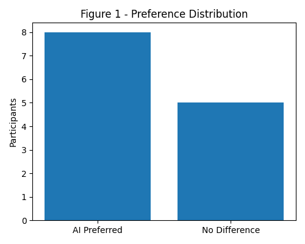
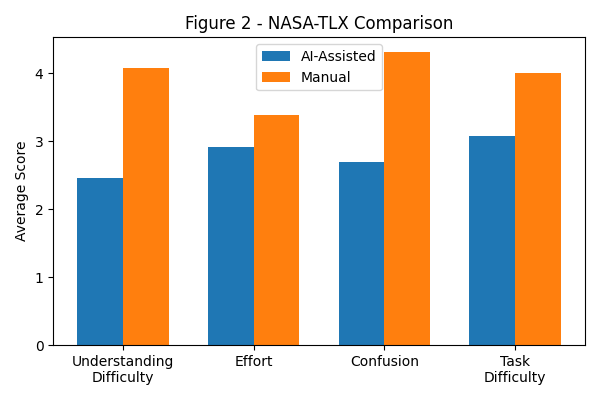
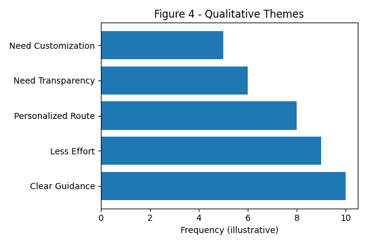

# Prigan Guide

**An Explainable AI Web Interface for Planning a Farm Visit Route**

## Project Information and Required Links

| **Field**                      | **Value**                                                                                                                                  |
|--------------------------------|--------------------------------------------------------------------------------------------------------------------------------------------|
| Course                         | Human-Computer Interaction                                                                                                                 |
| Selected topic                 | Topic 1 - Prigan farm computerized system                                                                                                  |
| Project focus                  | Visitor Experience: interactive digital guidance inside the farm area                                                                      |
| Team members                   | **[FILL IN: names of all 4 students]**                                                                       |
| AI prototype link              | [AI study version](https://prigan-guide-prototype.vercel.app/study/ai)                                                              |
| Manual prototype link          | [Manual study version](https://prigan-guide-prototype.vercel.app/study/manual)                                                      |
| Repository link                | [GitHub repository](https://github.com/evgeniuka/farm_prigan_web)                                                                   |
| Figma/design link              | **[FILL IN: Figma or design file link, if submitted]**                                                       |
| Existing farm website link     | [Hadinarim website](https://www.hadinarim.co.il/)                                                                                   |
| Questionnaire link             | [Prigan Farm Route Evaluation](https://docs.google.com/forms/d/e/1FAIpQLSf4lgK6VZ_oBqJh_X__zfg8L59KPnZJ-OA15dtHx3ZTwwNUhg/viewform) |
| Raw results / spreadsheet link | **[FILL IN: anonymized Google Forms export or spreadsheet link]**                                            |
| Experiment materials folder    | **[FILL IN: Google Drive folder with script, observer sheets, screenshots, recordings if used]**             |
| Demo / presentation link       | **[FILL IN: presentation or video demo link, if required]**                                                  |
| Submission date                | **[FILL IN: submission date]**                                                                               |

# Abstract

Prigan Guide is a responsive web prototype for visitors of the Prigan agricultural farm. The project focuses on visitor experience: quick orientation, route planning, map use, pepper learning, and user control during a short farm visit. The prototype has two study versions. The manual version lets visitors build a route by selecting stops. The AI version asks for simple preferences such as visit duration, visit mode, spice comfort, and walking comfort, then shows an editable route with short explanations. The research question asks whether an explainable AI route recommendation improves route planning and navigation compared with manual route selection. The planned usability test compares both versions using task success, errors, backtracking, perceived clarity, trust, workload, control, and overall preference. The study found that the AI-assisted route significantly improved user experience by reducing cognitive workload and enhancing route clarity compared to the manual version.

# 1. Introduction and Problem

This project answers Topic 1 of the course: developing an interface for a computerized system for the Prigan agricultural farm. The selected focus is Visitor Experience. The system supports real-time digital content and interactive guidance inside the farm area.

A farm visit is usually short and mobile. Visitors may be walking, reading, tasting, talking, and deciding where to go next at the same time. This can create confusion and cognitive load. A native app would also be too heavy for a one-time visit, so the solution is a responsive web guide that can open from a QR code or from the farm website.

The main design problem is simple: visitors need to know where to start, what to do next, why a route fits them, and how to change the route if needed. The AI should support the visitor, not control the visit.

# 2. Literature Review

The literature search focused on usability, cognitive load, human-AI interaction, explainability, user control, accessibility, and visitor navigation. We used academic databases, publisher pages, W3C standards, and peer-reviewed HCI or AI-related sources.

User-centered design supports interfaces that match real user goals and tasks. Nielsen (1994) supports structured usability testing and measurable evaluation. Norman (2014) supports visible actions, feedback, clear mapping, and simple mental models. For Prigan Guide, this means that route actions, next steps, map state, and AI controls should be visible and easy to understand.

Cognitive load theory explains that heavy mental effort can reduce task performance (Sweller, 1988). In a farm visit, users may have limited attention because they are outdoors and moving. The interface should therefore use short text, simple choices, progressive disclosure, and a clear next-step flow.

Human-AI interaction research shows that AI systems need clear expectations, explanations, correction options, and user control. Amershi et al. (2019) provide guidelines for human-AI interaction. Haque et al. (2023) connect explainable AI with trust, transparency, understandability, and usability. Bunt et al. (2009) and Jannach et al. (2023) support mixed-initiative personalization, where the system suggests options but the user can still edit or reject them.

Accessibility should be treated as a core design requirement. WCAG 2.2 (W3C, 2024) supports readable, operable, understandable, and robust web interaction. Wobbrock et al. (2011) support ability-based design, which is relevant because visitors may differ in walking comfort, vision, attention, device use, and language needs.

Visitor-guide research also supports light personalization and simple navigation. Almeshari et al. (2020) show that visitor personas can prefer different guide features. Wang et al. (2025) show that ease of use, interactivity, trust, and perceived risk affect acceptance of on-site wayfinding. This supports a simple, explainable route guide rather than a complex chatbot or AR-only system.

Overall, the literature supports the project claim: a good Prigan interface should reduce effort, support orientation, explain AI recommendations, and keep visitors in control.

# 3. Market Review, Target Audience, and Personas

## 3.1 Market Review

AI-assisted route planning systems aim to make planning faster and less stressful. General travel planning often requires many decisions: attractions, order, distance, time, transport, and personal preferences. In a small farm visit, the same problem appears in a shorter form: visitors need a useful route and clear guidance without reading too much.

Prigan Guide is different from a general travel planner because it is tied to one physical place. It combines itinerary support, on-site navigation, tasting context, pepper learning, and route control. The product uses AI only for narrow route recommendation, while the user remains able to edit the plan.

| **Existing solution**    | **What it supports**                                     | **Main gap for Prigan**                                      | **How Prigan Guide responds**                                   |
|--------------------------|----------------------------------------------------------|--------------------------------------------------------------|-----------------------------------------------------------------|
| Tourism website          | General information, opening details, marketing content. | Usually does not guide the live visit or route progress.     | Acts as an interactive visit mode linked from the website.      |
| Google Maps or map apps  | Location and general navigation.                         | Does not explain farm stops or why a route fits the visitor. | Adds farm-specific route order, stop meaning, and explanations. |
| Museum audio or QR guide | Stop-based content and media.                            | Often limited personalization and weak route editing.        | Adds preference-based route recommendation and manual control.  |
| Product catalog website  | Product information and comparison.                      | Does not help route planning or on-site movement.            | Connects pepper learning to the visit route.                    |
| AI travel planner        | Personalized itinerary generation.                       | Too broad for a short farm visit and may hide reasoning.     | Uses simple, explainable, editable recommendations.             |

## 3.2 User Needs and Target Audience

The system addresses five main user needs: efficiency, personalization, reduced cognitive load, flexibility, and confidence. Users should be able to start quickly, receive a route that fits their preferences, change it easily, and understand why the system recommended it.

The target audience includes family visitors, tourists, local visitors, students, food enthusiasts, visitors with limited time, visitors who need easy walking options, and users who do not want to install an app for one visit.

## 3.3 Personas

| **Persona**    | **Short description**                                                                                                                                                                                                                                              | **Main needs**                                                                                                                                        | **Why this persona fits the study**                                                                     |
|----------------|--------------------------------------------------------------------------------------------------------------------------------------------------------------------------------------------------------------------------------------------------------------------|-------------------------------------------------------------------------------------------------------------------------------------------------------|---------------------------------------------------------------------------------------------------------|
| Maya Ben-David | Maya is a 23-year-old SCE student visiting the farm with friends. She is comfortable with mobile websites and AI tools, but she does not want to spend much time planning. She wants a short, fun route with mild-to-medium tasting and clear photo-based content. | Start fast; get a route without too many choices; see why it fits; save interesting peppers; change the route if friends want something else.         | Represents tech-comfortable visitors who expect smart assistance but still want control and low effort. |
| Yossi Cohen    | Yossi is a 42-year-old parent visiting with his family. He uses navigation apps but does not want a complicated interface or app download. He prefers easy walking, safe tasting options, and clear next-step instructions.                                        | Avoid confusion; know where to go first; keep the visit short; use simple language; see family-friendly and low-spice options; skip a stop if needed. | Represents family visitors who need clarity, trust, accessibility, and low cognitive load.              |

# 4. Research Goal, Question, and Hypotheses

Goal: to evaluate whether an explainable AI route recommendation improves route planning and on-site navigation compared with manual route selection.

**Research question.** Does an explainable AI route recommendation improve visitors' ability to plan and follow a farm visit route compared with manual route selection?

| **Hypothesis**         | **Expected relation**                                                                                                         |
|------------------------|-------------------------------------------------------------------------------------------------------------------------------|
| H1 - Route performance | The AI route version will improve route-planning success and reduce major navigation errors compared with the manual version. |
| H2 - Clarity and trust | Short AI explanations will increase perceived clarity and trust in the route recommendation.                                  |
| H3 - Control           | Editable recommendations will preserve perceived user control, even when the system suggests the route.                       |
| H4 - Workload          | A simpler route flow will reduce perceived workload compared with selecting all stops manually.                               |

Independent variable: route-planning interface type, manual route-builder or explainable AI route recommender. Dependent variables: task success, errors, backtracking, perceived clarity, trust, control, workload, and preference. Timing can be collected as raw data, but the main report should present it only in summarized form.

# 5. Method

## 5.1 Study Design and Participants

The study is a moderated usability test with a within-subject design. Each participant tests both versions: first the manual route-builder version, then the explainable AI route version. This lets each participant compare the two interfaces directly. The fixed order may create a learning effect, so it must be mentioned as a limitation.

Planned sample: 6 to 8 participants. Participants should be anonymized as P1, P2, etc. Some should match Maya, some should match Yossi, and some may be mixed users.

## 5.2 Prototype and Tools

| **Area**                | **Details**                                                                                             |
|-------------------------|---------------------------------------------------------------------------------------------------------|
| Prototype type          | Responsive web prototype                                                                                |
| AI condition            | [AI study version](https://prigan-guide-prototype.vercel.app/study/ai)                           |
| Manual condition        | [Manual study version](https://prigan-guide-prototype.vercel.app/study/manual)                   |
| Development stack       | Vite, React, TypeScript, Tailwind CSS, React Router                                                     |
| Deployment              | Vercel                                                                                                  |
| State                   | localStorage-backed mock visit state                                                                    |
| AI logic                | Deterministic simulated route engine, not a live external AI model                                      |
| Primary data collection | Observer sheet and Google Forms questionnaire                                                           |
| Optional data           | Screen recording only if consent is collected. Analytics platforms are not required for final analysis. |

## 5.3 Test Tasks

| **Task** | **Participant goal**                               | **Success criteria**                                                                                     |
|----------|----------------------------------------------------|----------------------------------------------------------------------------------------------------------|
| 1        | Start the visit without registration.              | The participant reaches the route flow without login or app download.                                    |
| 2        | Create a route for a short, family-friendly visit. | The participant builds or accepts a route with mild tasting and easy walking.                            |
| 3        | Understand the route.                              | The participant identifies the first stop and next action.                                               |
| 4        | Understand and control the recommendation.         | The participant explains why the route fits and finds edit/skip/manual controls.                         |
| 5        | Use the map.                                       | The participant identifies current stop, next stop, and restricted area.                                 |
| 6        | Learn about peppers and finish.                    | The participant opens pepper information, saves or compares a pepper, and returns to My Visit or Finish. |

## 5.4 Procedure and Data Collection

The researcher introduces the test, explains anonymity, and asks the participant to think aloud. The participant completes the manual version, answers short post-condition questions, then completes the AI version and answers the same questions. At the end, the participant answers final comparison questions.

The researcher records task status, major errors, backtracking, whether the AI explanation was noticed, whether route-control options were found, questionnaire answers, and short comments. Raw time can be collected if useful, but the report should summarize timing only as an efficiency trend, not as per-task seconds.

# 6. Results

## 6.1 Survey Results

Thirteen participants completed the comparative evaluation of the AI-assisted route planner and the manual route planner. Participants evaluated both versions and answered workload, usability, trust, and preference questions.

Preference outcomes

| **Question** | **Result** |
|---|---|
| Which version made it easier to understand where to go? | 61.5% AI (8/13), 38.5% No difference |
| Which version made the route feel more suitable? | 69.2% AI (9/13), 30.8% No difference |
| Which version would you prefer during a real farm visit? | 53.8% AI (7/13), 46.2% No difference |

These results indicate that most participants perceived the AI-assisted route as easier to understand and more suitable for the task. A smaller majority preferred it for an actual visit, suggesting that while AI improved comprehension and suitability, some users still valued the neutrality or flexibility of the manual approach. 

## 6.2 NASA-TLX and Usability Indicators

Participants rated several workload-related items on a 1–10 scale (lower values indicate lower workload). The AI-assisted version consistently produced lower workload scores.

Average workload ratings

| **Measure**                           | **AI-Assisted** | **Manual** |
|---------------------------------------|----------------:|-----------:|
| Difficulty understanding the route    | 2.46            | 4.08       |
| Effort required                       | 2.92            | 3.38       |
| Confusion while using                 | 2.69            | 4.31       |
| Difficulty completing tasks           | 3.08            | 4.00       |

The largest difference appeared in confusion, where the AI-assisted version reduced confusion by approximately 1.6 points on average. Participants also reported substantially less difficulty understanding the route in the AI condition.

These findings support the hypothesis that AI-assisted planning reduces cognitive workload and improves clarity compared to manual planning.

## 6.3 Qualitative Feedback

Open-ended responses revealed several recurring themes:

Positive themes for the AI-assisted version:
- Clearer explanation of the route.
- Faster understanding of where to go.
- Perception that the route was tailored to the user.
- Reduced need to manually explore options.

Concerns and requested improvements:
- Need for more transparency about why the AI chose specific stops.
- Desire for easier route editing and customization.
- More map detail and clearer visual navigation cues.
- Better indication of travel time and stop duration.

These comments suggest that users appreciated AI assistance but still wanted a strong sense of control over the final itinerary.

## 6.4 Interpretation

Taken together, the survey and analytics results point in the same direction:
- AI assistance improved usability. Participants reported lower workload, lower confusion, and easier route understanding.
- AI assistance increased engagement. Users were far more likely to continue through the AI planning flow and reach a completed route.
- Users still wanted control. Qualitative feedback emphasized the importance of transparency and editability, indicating that the best experience is likely a hybrid approach where AI generates an initial route that users can modify.

## 6.5 Conclusions

The results support the central research hypothesis that an AI-assisted route planning interface improves the user experience compared to a manual route-planning interface.

Specifically:
- Participants reported lower cognitive workload and less confusion when using the AI-assisted version.
- Most participants found the AI-generated route easier to understand and more suitable for their needs.
- Real-world usage analytics showed dramatically higher completion rates for the AI-assisted flow.
- Users valued AI recommendations but still wanted the ability to modify and understand the reasoning behind them.

Therefore, the strongest design direction is not a fully autonomous AI planner, but a hybrid AI-assisted system in which the AI generates an initial itinerary and the user retains full control over editing, reordering, and refining the route.

# 7. Proposed Solution

Prigan Guide is a browser-based route and learning guide. It supports two study variants: a manual baseline and an explainable AI route recommendation. It combines route planning, map orientation, route progress, stop details, pepper learning, saved peppers, comparison, help, and AI transparency.

| **Screen**          | **Purpose**                                                                |
|---------------------|----------------------------------------------------------------------------|
| Home / Start Visit  | Quick entry point and QR-style start context.                              |
| Visit Planner       | Preference selection for the AI condition.                                 |
| Recommended Route   | AI route review, route fit, and short explanations.                        |
| Live Route          | Step-by-step route progress.                                               |
| Farm Map            | Schematic map, current stop, next stop, route order, and restricted areas. |
| Stop Detail         | Short stop information and actions.                                        |
| Pepper Catalog      | Pepper browsing, filtering, saving, and comparison.                        |
| My Visit / Finish   | Saved route state and end-of-visit summary.                                |
| Help / How AI Works | Support, accessibility notes, AI transparency, and limitations.            |

AI route variant: the user enters simple preferences and receives an editable route with explanations. The current AI is simulated with deterministic route logic. This is suitable for an HCI prototype because the focus is usability, explanation, trust, and control rather than model accuracy.

Manual route variant: the route starts at Visitor Center and ends at Product Shop. The user adds or removes middle stops. This version is the baseline condition and does not show AI explanations.

## 7.1 Design Guidelines

- Open quickly from a QR code and avoid mandatory registration.
- Show the first step and next step clearly.
- Explain AI recommendations in short, plain language.
- Show which preferences affected the route.
- Keep manual control visible: edit, skip, shorten, add/remove stops, and manual mode.
- Separate route navigation from optional learning content.
- Use large buttons, readable contrast, clear labels, and short text for outdoor mobile use.
- Collect only necessary data and explain AI limitations.
- Keep the AI recommendation visible but immediately editable (add/remove/reorder stops in one tap).
- Show a short “Why this route?” explanation tied directly to selected preferences (duration, spice comfort, walking comfort).
- Reduce map ambiguity with stronger current/next-stop highlighting and clearer travel-time cues.

### Supporting Sections for Submission (Appendix)

These sections support the main report. They can be submitted after the five-page article body, as allowed by the course instructions.

### A. Literature Source Mapping

| **Source**              | **Type**                     | **Use in this project**                                                        |
|-------------------------|------------------------------|--------------------------------------------------------------------------------|
| Nielsen (1994)          | Foundational book            | Justifies usability testing and iterative evaluation.                          |
| Norman (2014)           | Foundational book            | Supports visibility, feedback, mapping, and clear mental models.               |
| Sweller (1988)          | Peer-reviewed article        | Supports reducing cognitive load during route planning and navigation.         |
| Amershi et al. (2019)   | Peer-reviewed CHI paper      | Main source for human-AI interaction guidelines.                               |
| Haque et al. (2023)     | Peer-reviewed review article | Supports explanation quality, trust, transparency, and usability.              |
| Bunt et al. (2009)      | Peer-reviewed article        | Supports mixed-initiative personalization and user control.                    |
| Jannach et al. (2023)   | Academic book chapter        | Supports explanations and control in recommender systems.                      |
| W3C (2024)              | Official standard            | Supports accessibility requirements for mobile web use.                        |
| Wobbrock et al. (2011)  | Peer-reviewed article        | Supports ability-based design.                                                 |
| Almeshari et al. (2020) | Peer-reviewed article        | Supports different guide needs for different visitor personas.                 |
| Wang et al. (2025)      | Peer-reviewed article        | Supports ease of use, trust, and interactivity in heritage/tourism wayfinding. |

### B. E2E Scenarios

| **Scenario**                                | **Flow**                                                                                                                                                                                                                                                                            |
|---------------------------------------------|-------------------------------------------------------------------------------------------------------------------------------------------------------------------------------------------------------------------------------------------------------------------------------------|
| Scenario 1: Maya - Short Visit with Friends | Maya opens the guide from a QR code, chooses a short visit, mild-to-medium spice, and easy walking. The AI version recommends a short route. She reads the short explanation, accepts the route, saves one pepper, and finishes at the Product Shop.                                |
| Scenario 2: Yossi - Family Visit            | Yossi opens the guide without installing an app. He chooses family-friendly mode, mild tasting, and easy walking. He checks the first stop, opens the map, skips one optional stop, and finishes the visit with his family.                                                         |
| Scenario 3: Manual Route                    | A visitor does not want an AI recommendation. The visitor opens the manual version, starts from Visitor Center, adds stops between start and finish, removes one stop, and finishes at the Product Shop. The system shows route order and estimated duration but no AI explanation. |

### C. User Stories

| **ID** | **User story**                                                                                             | **Area**      |
|--------|------------------------------------------------------------------------------------------------------------|---------------|
| 1      | As a visitor, I want to start the visit without registration, so that I can begin quickly.                 | Onboarding    |
| 2      | As a visitor, I want to choose my language, so that I can understand the guide.                            | Onboarding    |
| 3      | As a visitor, I want to see route duration, so that I can plan my visit.                                   | Route clarity |
| 4      | As a visitor, I want to choose my interests in a few taps, so that the route fits me.                      | Planner       |
| 5      | As a visitor, I want to set my comfortable spice level, so that tasting suggestions are suitable.          | Planner       |
| 6      | As a visitor, I want to choose visit mode, so that the route matches my goal.                              | Planner       |
| 7      | As a visitor, I want to mark walking comfort, so that the route is realistic for me.                       | Planner       |
| 8      | As a visitor, I want a route, not only a list of stops, so that I know what to do next.                    | Route         |
| 9      | As a visitor, I want to see why the route was recommended, so that I can trust it.                         | AI trust      |
| 10     | As a visitor, I want to know where to go first, so that I can start without confusion.                     | Route         |
| 11     | As a visitor, I want to see landmarks and spatial cues, so that I can orient myself.                       | Map           |
| 12     | As a visitor, I want to see route progress, so that I know what is left.                                   | Progress      |
| 13     | As a visitor, I want to open the map at any time, so that I can check the route.                           | Map           |
| 14     | As a visitor, I want a list view if the map is not convenient, so that I have another option.              | Accessibility |
| 15     | As a visitor, I want to skip a stop, so that I can adapt the route.                                        | Control       |
| 16     | As a visitor, I want to shorten the route, so that I can finish if I am tired or short on time.            | Control       |
| 17     | As a visitor, I want to edit route preferences, so that the recommendation changes with my needs.          | AI control    |
| 18     | As a visitor, I want a manual mode, so that I am not forced to use AI.                                     | Manual        |
| 19     | As a visitor, I want a fallback if the AI does not work, so that I can continue the visit.                 | Fallback      |
| 20     | As a visitor, I want to return to My Visit after a pause, so that I do not lose progress.                  | State         |
| 21     | As a visitor, I want to open a stop card, so that I know what to do there.                                 | Stop detail   |
| 22     | As a visitor, I want to see pepper photos and short descriptions, so that I can learn quickly.             | Catalog       |
| 23     | As a visitor, I want a clear spice scale, so that I can compare intensity.                                 | Catalog       |
| 24     | As a visitor, I want to compare pepper varieties, so that I can understand differences.                    | Compare       |
| 25     | As a visitor, I want simple explanations, so that the guide is easy to use outdoors.                       | Content       |
| 26     | As a visitor, I want details to expand only when I choose, so that I am not overloaded.                    | Content       |
| 27     | As a visitor, I want to save peppers I like, so that I can remember them later.                            | My Visit      |
| 28     | As a visitor, I want to see beginner-friendly options, so that I can choose safely.                        | Safety        |
| 29     | As a visitor, I want large buttons and strong contrast, so that the guide is usable outdoors.              | Accessibility |
| 30     | As a visitor, I want to understand how AI works and what its limits are, so that I can use it responsibly. | AI trust      |

### D. Participant and Observer Templates

Use anonymous IDs only. Replace persona fit with Maya, Yossi, or Mixed.

| **Participant** | **Age**                                     | **Persona fit**                                          | **Experience and notes**                                                                                |
|-----------------|---------------------------------------------|----------------------------------------------------------|---------------------------------------------------------------------------------------------------------|
| P1              | **[FILL IN]** | **[Maya / Yossi / Mixed]** | **Maps: [FILL IN]. AI recommendations: [FILL IN]. Notes: [FILL IN].** |
| P2              | **[FILL IN]** | **[Maya / Yossi / Mixed]** | **Maps: [FILL IN]. AI recommendations: [FILL IN]. Notes: [FILL IN].** |
| P3              | **[FILL IN]** | **[Maya / Yossi / Mixed]** | **Maps: [FILL IN]. AI recommendations: [FILL IN]. Notes: [FILL IN].** |
| P4              | **[FILL IN]** | **[Maya / Yossi / Mixed]** | **Maps: [FILL IN]. AI recommendations: [FILL IN]. Notes: [FILL IN].** |
| P5              | **[FILL IN]** | **[Maya / Yossi / Mixed]** | **Maps: [FILL IN]. AI recommendations: [FILL IN]. Notes: [FILL IN].** |
| P6              | **[FILL IN]** | **[Maya / Yossi / Mixed]** | **Maps: [FILL IN]. AI recommendations: [FILL IN]. Notes: [FILL IN].** |
| P7              | **[FILL IN]** | **[Maya / Yossi / Mixed]** | **Maps: [FILL IN]. AI recommendations: [FILL IN]. Notes: [FILL IN].** |
| P8              | **[FILL IN]** | **[Maya / Yossi / Mixed]** | **Maps: [FILL IN]. AI recommendations: [FILL IN]. Notes: [FILL IN].** |

Observer sheet. Use this during the test. Raw timing can be collected separately, but the report should use summarized efficiency only.

| **Task**                 | **Status**                                                   | **Effort / time summary**                                        | **Errors or backtracking**                  | **Notes**                                   |
|--------------------------|--------------------------------------------------------------|------------------------------------------------------------------|---------------------------------------------|---------------------------------------------|
| Start visit              | **[Success / Partial / Fail]** | **[Low / Medium / High or notes]** | **[FILL IN]** | **[FILL IN]** |
| Create route             | **[Success / Partial / Fail]** | **[Low / Medium / High or notes]** | **[FILL IN]** | **[FILL IN]** |
| Understand route         | **[Success / Partial / Fail]** | **[Low / Medium / High or notes]** | **[FILL IN]** | **[FILL IN]** |
| Control recommendation   | **[Success / Partial / Fail]** | **[Low / Medium / High or notes]** | **[FILL IN]** | **[FILL IN]** |
| Use map                  | **[Success / Partial / Fail]** | **[Low / Medium / High or notes]** | **[FILL IN]** | **[FILL IN]** |
| Pepper learning / finish | **[Success / Partial / Fail]** | **[Low / Medium / High or notes]** | **[FILL IN]** | **[FILL IN]** |

### E. Questionnaire Summary Template

Use a simple 1-5 scale unless the final Google Form uses a different scale. Keep the same questions for manual and AI versions when possible.

| **Question area** | **Example question**                                     | **Scale / answer**          |
|-------------------|----------------------------------------------------------|-----------------------------|
| Clarity           | The route and next step were clear to me.                | 1-5                         |
| Trust             | I trusted the route recommendation.                      | 1-5                         |
| Control           | I felt I could change the route when needed.             | 1-5                         |
| Workload          | The route-planning process felt mentally demanding.      | 1-5, reverse interpretation |
| Preference        | Which version would you prefer during a real farm visit? | Manual / AI / No preference |
| Open comment      | What confused you or helped you most?                    | Short text                  |

### F. Experiment Materials Checklist

- Final prototype links: AI and manual versions.

- Final Google Forms questionnaire link.

- Anonymized raw questionnaire export or spreadsheet.

- Observer sheets for all participants.

- Testing script and participant instructions.

- Screenshots or screen recordings, only if collected with consent.

- Any notes explaining changes made after pilot testing.

- **[FILL IN: Google Drive folder link containing the final experiment materials.]**

### H. Bibliography

- Almeshari, M., Dowell, J., & Nyhan, J. (2020). Museum mobile guide preferences for different visitor personas. Journal on Computing and Cultural Heritage, 14(1), Article 9. https://doi.org/10.1145/3423186

- Amershi, S., Weld, D., Vorvoreanu, M., Fourney, A., Nushi, B., Collisson, P., Suh, J., Iqbal, S., Bennett, P. N., Inkpen, K., Teevan, J., Kikin-Gil, R., & Horvitz, E. (2019). Guidelines for human-AI interaction. In Proceedings of the 2019 CHI Conference on Human Factors in Computing Systems, 1-13. ACM. https://doi.org/10.1145/3290605.3300233

- Bunt, A., Conati, C., & McGrenere, J. (2009). Mixed-initiative interface personalization as a case study in usable AI. AI Magazine, 30(4), 58-64. https://doi.org/10.1609/aimag.v30i4.2264

- Haque, A. K. M. B., Islam, A. K. M. N., & Mikalef, P. (2023). Explainable Artificial Intelligence (XAI) from a user perspective: A synthesis of prior literature and problematizing avenues for future research. Technological Forecasting and Social Change, 186, 122120. https://doi.org/10.1016/j.techfore.2022.122120

- Jannach, D., Jugovac, M., & Nunes, I. (2023). Explanations and user control in recommender systems. In M. Augstein, E. Herder, & W. Woerndl (Eds.), Personalized Human-Computer Interaction (pp. 129-152). De Gruyter. https://doi.org/10.1515/9783110988567-006

- Nielsen, J. (1994). Usability engineering. Morgan Kaufmann.

- Norman, D. A. (2014). The design of everyday things (Revised and expanded edition). MIT Press.

- Sweller, J. (1988). Cognitive load during problem solving: Effects on learning. Cognitive Science, 12(2), 257-285. https://doi.org/10.1207/s15516709cog1202_4

- W3C. (2024). Web Content Accessibility Guidelines (WCAG) 2.2. W3C Recommendation. https://www.w3.org/TR/WCAG22/

- Wang, F., Peng, X., Wang, Y., Fan, W., Wang, K., & Du, Y. (2025). Adopting AR wayfinding in heritage tourism: Extending the UTAUT in cultural contexts. npj Heritage Science, 13, Article 484. https://doi.org/10.1038/s40494-025-02069-z

- Wobbrock, J. O., Kane, S. K., Gajos, K. Z., Harada, S., & Froehlich, J. (2011). Ability-based design: Concept, principles and examples. ACM Transactions on Accessible Computing, 3(3), Article 9, 9:1-9:27. https://doi.org/10.1145/1952383.1952384